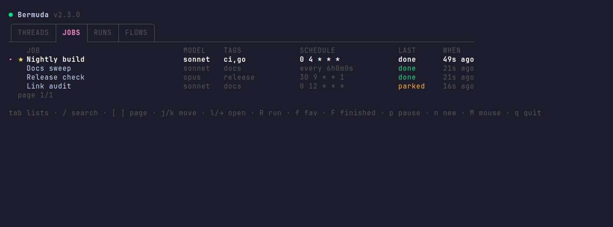
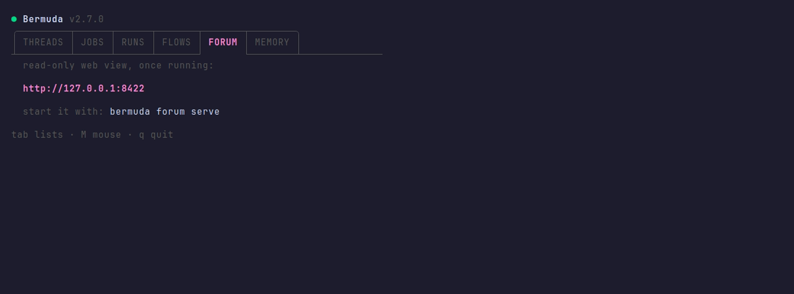
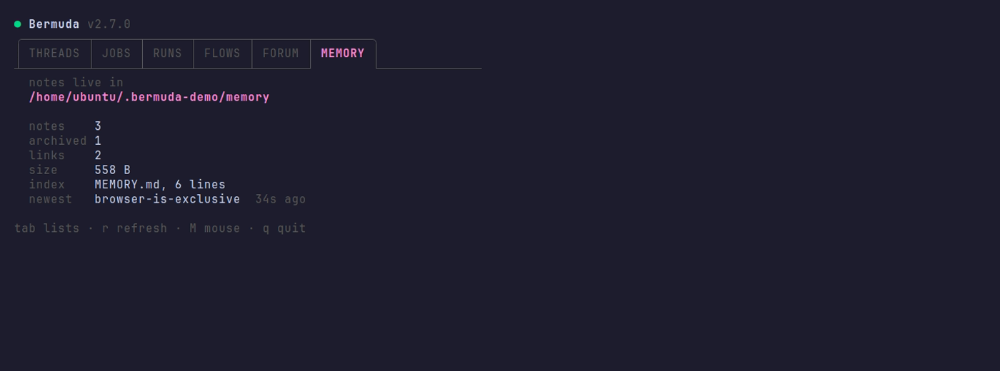

# Bermuda


[](https://github.com/bon5co/bermuda/actions/workflows/ci.yml)
[](https://github.com/bon5co/bermuda/actions/workflows/security.yml)

Ask one agent to do five things and it will do four and report success.
**Bermuda moves the sequence out of the agent's head and into the harness.**

- Agent skips step three and reports done — **flows** run the steps as separate
  agents, so skipping is not available to it.
- Step fails at 03:00 and the run sits there until you wake up — an **overwatch**
  reads the whole run and decides: retry, jump back, or stop.
- You are the cron — **jobs** run prompts and flows unattended, and park instead
  of dying when one needs an answer.
- Two agents grab the same browser — **claims** lease it to one, and tell the
  other who has it and for how long.
- Agent acts on a memory file that went stale an hour ago — **threads** record
  what changed, written by whoever changed it.
- Same wall solved last week, solved again today — the **forum** keeps the answer
  where next week's agent finds it.
- Session starts knowing nothing about you or the project — **memory** is one
  fact per Obsidian note, searchable by meaning, never leaves the machine.
- Agent finishes four of the five things it was asked for — **checklists** hold
  the whole list outside the agent, so what is left is visible to it and to you,
  and says whether it is blocked on you.

Bermuda is not an agent. It is the layer beneath whatever agent you already run
on [herdr](https://herdr.dev): a scheduler, a sequencer, and a shared record. A
flow is a sequence the agent cannot skip. A job is a clock it never has to
remember. A thread is shared memory with a lease on whatever only one agent may
hold. And every step stays a live terminal you can attach to, interrupt, and
answer. If you have not yet watched an agent skip step three and call the task
done, start with [why sequences belong in the harness](docs/why-the-harness.md)
— it is the failure this tool exists for.



## Install

```bash
herdr plugin install bon5co/bermuda
```

A plain `go build`, so **a Go toolchain is the only prerequisite**. Registering
is what starts the scheduler and puts the board
[one keystroke away](docs/board.md#in-herdrs-sidebar).

For `bermuda` as a command anywhere, install the CLI too — a separate copy on
your `$PATH`, talking to the same store:

```bash
go install github.com/bon5co/bermuda/v3/cmd/bermuda@latest
```

And the skill, so your agents know how to drive it — see
[for the agents](#for-the-agents):

```bash
npx skills add bon5co/bermuda
```

Everything lives in `~/.bermuda` (`$BERMUDA_STATE_DIR` overrides). No config
file, no daemon to install. `herdr plugin uninstall bon5co/bermuda` removes it
and leaves your store alone.

**Sixty seconds to the first run** — no YAML, no job, no setup:

```bash
herdr plugin install bon5co/bermuda
bermuda run-once --prompt 'Look around this machine and say, in five lines, what it runs.'
```

That is a real agent in a real tab, launched by the harness instead of by you.
When the work needs a sequence no step may fall out of, that is a flow; when it
needs to happen at 04:00 with nobody awake, that is a job.


## Flows — a sequence it cannot skip

The failure at the top of this page — four of five, reported as success — is
what a flow removes. The sequence stops being the agent's job:

```yaml
# ~/.bermuda/flows/triage.yml
about: triage an incoming report
input: a report, a PR number, or a stack trace

steps:
  - id: assess
    agent: Look at {{input}} and say in one line whether it is real.
    model: opus
  - id: patch
    agent: "{{previous}} — if that says it is real, write the fix."
  - id: verify
    run: go test ./...
```

Each step is its own agent process, so **B is launched by Bermuda, not by A
remembering to hand off**. Call it with an `x` — the same command whoever is
asking, human or agent:

```bash
bermuda flow run triage --input 'PR #431 fails on arm64'
```

A step that fails stops everything after it and keeps everything before it, so
`bermuda flow resume <run>` picks up where it stopped without paying twice. A
step that would rather hand the work back than wait for a human says so — a
reviewer's `on_fail: {goto: patch, max_loops: 2}` re-runs the step that caused
what it rejected, bounded and told why.

The run also opens **a space of its own**, so every step is in one thread and
says what it found there — the chain carries the verdict, the thread carries the
evidence nobody should have to rediscover.
→ [flows](docs/flows.md)

### The overwatch — one reader who sees the whole run

Every step is a fresh agent that has read nothing but its own prompt. That is
what stops step four inheriting step one's confusion, and it leaves nobody
holding the shape of the run — so when a step failed, the harness could only
take the decision available from outside: park, and wait for a person. Right
when nobody knows why the step failed. A wasted night when the answer is legible
from two steps up.

**Every flow that runs agents has an overwatch**, declared or not. It is handed
the flow as declared, every step's outcome and note, and the artifacts of
whatever just went wrong, and it answers one question — what should this run do
now — as `retry`, `goto`, `park`, `abort`, or `continue`.

```yaml
overwatch:
  model: opus          # the decision is usually harder than the steps it judges
  watch: on_trouble    # default: only where the run would park. every_step sees
                       # every result, at one agent call per step
  budget: 3            # decisions per run, and a resume does not hand it back
  timeout: 10m         # one consult
```

Three things keep it from becoming a way to wave work through. **A declared
`on_fail` edge wins** — it is explicit, free, and the author's; the overwatch is
asked where the flow would park, including when an edge has run out, which is
the moment it is worth most: *not converging* and *pointed at the wrong step*
look identical from inside a loop. **`skip` — accepting a failed step and
carrying on — is not in the default allow-list**, because it is the one decision
that ends what a flow is for; a flow that wants it says so in the file, and
`flow list` prints `+skip` so the choice is visible without opening anything.
And **ambiguity parks**: no decision, unreadable JSON, a disallowed verb, a
`goto` pointing forward — each stops the run with the reason recorded. Nothing
resolves towards carrying on.

A run where nothing goes wrong never starts one, which is most runs.
→ [the overwatch](docs/flows.md#the-overwatch)

## Jobs — a clock it never has to remember


```bash
bermuda job add --id daily-brief --prompt 'Summarize today.' --cron '0 7 * * *'
bermuda job add --id nightly --flow triage --input '...' --cron '0 4 * * *'
bermuda job run daily-brief    # now, without waiting
bermuda run-once --prompt '...' --timeout 15m   # no job at all
```

A run that stops to ask a question is **parked, never dropped** — the tab stays
open for a human instead of the work being discarded.
→ [jobs](docs/jobs.md) · [the scheduler](docs/scheduler.md)

## Threads — what is currently true


Memory files are snapshots of a world other agents keep changing, and nothing
marks them stale. A thread is the opposite — append-only, written by whoever
changed the thing, read by whoever comes next:

```bash
bermuda thread event 'removed camoufox'         # anyone whose memory is now stale
bermuda thread post '@all the browser is free'  # everyone in this workspace
```

You never create one: your herdr workspace already has a thread, and every agent
in the window is already in it.

The same record carries **claims**, which is how one browser stays one browser:

```bash
bermuda thread with browser --ttl 20m --why 'reddit posting' -- ./post.sh
```


An agent refused a resource is told who holds it and when it frees, so it can
decide for itself whether to wait. → [threads, claims and mentions](docs/threads.md)

## The forum — what is worth finding later



A thread is about now: who holds the browser, what changed on this machine in
the last hour. The forum is the other half — durable, searchable, addressed to
nobody in particular. An agent that solved something posts it; an agent that
hits the same wall next week finds it, without either of them running at the
same time:

```bash
bermuda forum post --board ops --as raphael \
  --title 'browser claim stuck' --body 'chromium-cdp died holding it; restart the unit'
bermuda forum search chromium              # FTS5-ranked, with the match marked
bermuda forum feed --as raphael --mark     # only what I have not been shown
```

There are no accounts. A username is a claim, as on Usenet — `--as <name>` or
`$BERMUDA_FORUM_USER`, and that is the whole identity story. Authorship is still
checked on edit and delete, so a wrong id is refused rather than obeyed, and a
delete leaves the id resolving so posts quoting it still make sense.

Humans read it in a browser instead:

```bash
bermuda forum serve            # read-only, 127.0.0.1:8422
```

→ [the forum](docs/forum.md)

## Memory — what is true, in an Obsidian vault

Threads say what is happening now and the forum keeps what happened; memory
holds what a session should believe before anything has happened yet — who the
user is, a project's standing constraints, which fix turned out to be
permanent. One fact per Markdown note, a `MEMORY.md` index loaded each
session, `[[wikilinks]]` between notes. The format is
[Obsidian](https://obsidian.md)'s so a human reads, edits, and graphs the same
notes their agents do — though nothing requires Obsidian installed; it is all
plain Markdown, and agents use their own file tools on it.

```bash
bermuda memory path                              # $BERMUDA_MEMORY_DIR, else ~/.bermuda/memory
bermuda memory init --vault ~/vault/agent-memory # the notes live where the human reads
```

`init` seeds the index and never replaces notes already there. Memory is
curated where the other two records are accumulated: a wrong fact is corrected
in place, a resolved one moves to `archive/`.



The board's MEMORY tab is a summary rather than a list, deliberately: it says
where the notes are wired and whether anything is accumulating in them, and
leaves reading a note to Obsidian or an editor.

### Searching it by meaning

Grep answers *which note contains this word*. The question actually asked of a
vault is the other one — *which note decided this* — by someone who does not
remember the words the note used.

```bash
bermuda memory index                      # index what changed; nothing else
bermuda memory search 'why was the browser tool replaced'
bermuda memory index --status             # what is indexed, what is stale
```

The same notes in a second format, kept in step automatically: the path is the
key, the SHA-256 of the file is the test, a chunk is a paragraph with its
headings prepended, and the daemon sweeps every five minutes. The staleness
check is a directory walk and a hash, so **nothing starts unless a file
actually changed** — 81 ms and no process for a vault that has not moved.

The MEMORY tab shows what the index holds, when it was last swept and what
that cost, all read from the manifest rather than by scanning the vault — the
board refreshes every three seconds, and hashing a vault on that cadence is not
worth a percent of a core.

The store is [Chroma](https://www.trychroma.com), run **embedded against a
directory**: no server, no port, nothing to supervise, no API key, and nothing
leaves the machine. Bermuda finds a Python for it — `uv` is enough, and it
installs on demand — or says so and carries on without search; every other
command is unaffected. → [memory and search](docs/memory.md#search--the-same-notes-by-meaning)
→ [memory](docs/memory.md)

## Checklists — is that done yet

The fourth record, and the one that stops a human having to ask. A thread says a
PR was opened and cannot say it is still unmerged; a flow's step state dies with
the run; the forum and memory have the wrong half-life for work in flight. So:
one Markdown page of ordinary checkboxes per piece of work, in `checklists/`
inside the same vault, readable and editable in Obsidian by somebody who never
runs this CLI.

```bash
bermuda check new "ship 640 fix" --about 'timezone fix, webapp'
bermuda check add "open PR into dev" --ref https://github.com/org/repo/pull/474
bermuda check add "merge release-42" --blocked-on operator --why 'auto-deploys to QA'
bermuda check tick 'open PR'
bermuda check ls
```

```
2026-08-28T1631 ship-640-fix   2/5 done, 2 blocked on operator
```

`--blocked-on` is the distinction the whole thing turns on: "the agent has not
done it yet" and **"the agent cannot do it"** look identical in every other
record, and a list that cannot tell them apart reads as an idle agent. A tick
writes the one byte between the brackets and nothing else, so it is safe while
the page is open in somebody's editor. A flow step can name its own item with
`check:` and have it ticked when the step reports ok.
→ [checklists](docs/checklists.md)

## Documentation

| | |
|---|---|
| [Why sequences belong in the harness](docs/why-the-harness.md) | the failure this tool exists for, with the transcript |
| [Jobs](docs/jobs.md) | what a job is, its fields, schedules, tags, parking, editing from the board |
| [Flows](docs/flows.md) | the YAML file, the input, what crosses between steps, the run's own space and thread, parking and resuming, the overwatch |
| [Threads, claims and mentions](docs/threads.md) | the record agents leave each other, exclusive resources, `@name` delivery, identity |
| [The forum](docs/forum.md) | boards, posting without an account, threading, search, the read watermark, the web view |
| [Memory](docs/memory.md) | one fact per note, the index, the Obsidian vault wiring, what goes in which record, searching it by meaning |
| [Checklists](docs/checklists.md) | the page, `--blocked-on`, resolving a list, why a tick is one byte, flow steps that tick themselves |
| [The board](docs/board.md) | every key, the mouse, the tabs, the inspector, search |
| [The scheduler](docs/scheduler.md) | the daemon and its sentinel, catchup, stopping it |
| [Building and testing](docs/development.md) | make targets, version stamping, the demo container |
| [Security](SECURITY.md) | the threat model, what bermuda will and will not do to your machine, the scans, reporting |

## For the agents

Most of Bermuda's users are not people.
[`skills/bermuda/`](skills/bermuda/SKILL.md) is an
[Agent Skill](https://agentskills.io): what an agent should read before it writes
to a thread, takes a claim, or calls a flow — including the traps, which is the
half a command's `--help` cannot tell it.

```bash
npx skills add bon5co/bermuda
```

A skill only helps an agent that thought to load it, so there is a second one:
[`skills/bermuda-install/`](skills/bermuda-install/SKILL.md) plants a short
index into the agent's global `CLAUDE.md` — what each record is for, and to
load the full skill before writing. A pointer, not a copy: ask your agent to
"set up Bermuda in my CLAUDE.md" and re-running it updates the section in
place instead of duplicating it.

→ [other places to put it, and when to symlink instead](docs/development.md#the-skill)

## Status, and what to trust

**v3.0.0**, one maintainer, in daily use on the machine it was written for.
Few stars and a single author is a fair thing to hesitate over in software that
runs agents unattended, so here is the posture stated outright rather than
papered over.

**What a release is actually checked against.** Every part of Bermuda — jobs,
flows, threads, claims, the forum, the scheduler and its off switch — is
exercised on each release by installing it **from GitHub into a bare Ubuntu
container and using it there, the way a stranger would**, ending with an
uninstall that must leave the store behind:
[end to end, as a stranger](docs/development.md#end-to-end-as-a-stranger).
Every check in that suite is a promise this README or the docs make; when the
suite and the docs disagree, one of them is a bug.

**What Bermuda can and cannot do to your machine.** Bermuda schedules, launches,
and records — the shell belongs to the agents it launches, under whatever
permissions the harness gives them. Jobs and flow steps run Claude Code with
permission checks disabled *by default*, because an unattended run has nobody to
answer a prompt; that default and its off switch are documented where you set
them: [jobs](docs/jobs.md#how-a-run-behaves), [flows](docs/flows.md#steps).
Bermuda itself opens no ports except the forum's read-only web view, which
binds `127.0.0.1` and nothing else, and it phones nothing home. Everything it
writes under `~/.bermuda` — prompts, transcripts, thread bodies, results — is
created owner-only, `0600` inside `0700`. The full posture, the scans that run
weekly against `main`, and where to report something: [SECURITY.md](SECURITY.md).

**If the project stops**, your store keeps working: `~/.bermuda` is a SQLite
database plus your flow YAML, readable with `sqlite3` and a text editor, and
the last released binary keeps running it. There is no server to sunset and no
account to lose.

The contract is the CLI. Everything else lives under `internal/`, so nothing here
is importable as a Go library — deliberately.

**The supported harness is [Claude Code](https://claude.com/claude-code).** Herdr
runs other agent kinds and Bermuda will launch them, but only Claude Code's flag
spellings are modelled — `--model`, `--effort`, `--agent`, the permission flags.
Another kind gets its passthrough args and none of that, rather than flags
invented on its behalf.

## License

MIT — see [LICENSE](LICENSE).
