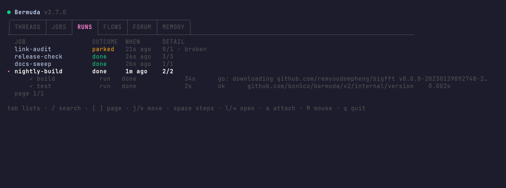

# bermuda

An agent harness. Bermuda schedules work and runs each job as an **interactive
herdr agent** — not a headless `claude -p` — so every run can be attached,
inspected, interrupted, and answered while it is happening.


## Install

Bermuda needs [herdr](https://herdr.dev) — it is where the runs live — and a Go
toolchain to build with. Nothing else.

```bash
go install github.com/bon5co/bermuda/cmd/bermuda@latest   # or: git clone && make build
herdr plugin link /path/to/bermuda                        # registers the board, hooks and actions
```

The plugin registration is what starts the scheduler and puts the board one
keystroke away; without it bermuda is still a working CLI, and `bermuda board`
opens the board wherever you run it.

Registration also puts bermuda in Herdr's sidebar, in the agents list above
Spaces. Herdr has no plugin surface for a sidebar entry, but `pane report-agent`
takes a free-form label, so the board reports its own pane as the agent
`bermuda`: the row is there for as long as a board is open, and clicking it goes
to the board. Its state is the useful half — **blocked** whenever a run is
parked, since a parked run is one waiting on a human and Herdr highlights
blocked agents as needing attention. A startup hook opens one board unfocused in
bermuda's own workspace (`bermuda board --pin`), so the row exists before
anybody has asked for it, and reopening it is a click rather than a command you
have to remember.

Everything bermuda stores lives in `~/.bermuda` (override with
`$BERMUDA_STATE_DIR`). There is no config file and no daemon to install.

`demo/` builds a clean Ubuntu container with herdr, bermuda and a demo store in
it, and takes the screenshots in this README from a real terminal:

```bash
docker build --build-arg VERSION=$(git describe --tags --always) -f demo/Dockerfile -t bermuda-demo .
docker run --rm --cap-add SYS_ADMIN -v "$PWD/assets:/out" bermuda-demo
```

## Why

Headless agent runs are invisible until they finish, and a run that stops to
ask a question is simply a lost run. Bermuda drives [herdr](https://herdr.dev)
as its execution substrate, which means:

- a run that needs a human goes to `blocked`, and bermuda **parks** it with the
  tab left open instead of failing it
- `herdr agent attach` drops you straight into a live run
- `herdr agent send-keys` lets bermuda (or you) answer a prompt and resume

## Design

- **Dedicated workspace.** All runs live in a `bermuda` workspace, one tab per
  run. Your own session is never touched.
- **Result channel.** Each run gets `BERMUDA_RUN_DIR` injected into the agent's
  shell. The agent writes `result.json` there, and that file is the *only*
  authority on a run's outcome. Terminal output is archived as
  `transcript.txt` for humans and is never parsed.
- **Park, never drop.** Timeout, `blocked`, and "agent exited without writing
  result.json" all park the run for a human rather than discarding it.

## Status

Early. `bermuda run-once` executes a single job through the full runner
lifecycle. The scheduler daemon, store, and TUI board build on the same runner.

```
bermuda run-once --prompt 'Summarize today.' --timeout 15m
```

## Jobs

A job is a schedule plus the exact agent invocation it produces.

Every job has two identifiers. The **id** is the handle you type
(`bermuda job run bl-board-review`) and is used for agent names and run
directories, so it stays slug-shaped and stable. The **name** is free text for
humans, and is what the board lists. Both are unique: `job add` refuses an id
that already exists, and no two jobs may share a name, since the board
identifies jobs by name.

```bash
bermuda job add --id daily-brief --name "Daily brief" \
  --prompt 'Summarize the day.' --cron '0 7 * * *' \
  --model sonnet --permission-mode acceptEdits \
  --add-dir /path/one,/path/two --timeout 20m --favorite

bermuda job add --id oneshot  --prompt '...' --at '2026-07-26 09:00'
bermuda job add --id hourly   --prompt '...' --interval 1h --persistent

bermuda job add --id promo --prompt '...' --tags marketing,daily

bermuda job list
bermuda job list --tag daily        # only jobs carrying a tag
bermuda job list --all             # include finished one-shots
bermuda job prune                  # list finished one-shots, delete nothing
bermuda job prune --yes            # actually delete them; their runs are kept
bermuda job show <id>              # config, resolved argv, prompt, run history
bermuda job edit <id> --model opus # only the flags you pass are changed
bermuda job pause <id> / resume <id>
bermuda job run <id>               # run now
bermuda run list [--state parked] [--json]
bermuda run show <run-id>          # artifacts: prompt.md, transcript.txt, result.json
bermuda usage [--since 24h]        # token totals per job, newest first
```

Every run records what it cost. Input, output, cache-read and cache-creation
tokens are stored separately because they are billed differently, alongside the
model the run actually used. The numbers come from the agent's own session
transcript, correlated by the run directory bermuda names in its prompt — never
by picking the newest session, which would mis-charge concurrent agents and
persistent jobs. A transcript that cannot be read leaves the counts at zero: a
run keeps its real outcome regardless, since this is bookkeeping, not the work.

Jobs run with permission checks disabled by default. A scheduled job is
unattended, so a permission prompt has nobody to answer it: the run would park
until a human noticed, which is worse than useless for work meant to happen at
04:00. Pass `--skip-permissions=false` for a job you intend to supervise.

Every job names a model. Leaving `--model` unset resolves to `sonnet` rather
than to whatever the agent happens to default to, so a schedule's cost and
capability cannot change underneath it without the job changing.

Schedules: `manual`, `--cron`, `--interval`, `--at` (one-shot, disables itself
after it runs). `--catchup` decides what happens to fires missed while nothing
was running:

| policy | after six missed hourly fires |
|--------|-------------------------------|
| `latest` (default) | one run, for the window as a whole |
| `all` | six runs, in series, one after another |
| `skip` | nothing — the window is gone |

A fire less than a minute old counts as current rather than missed, so `skip`
still runs the fire the scheduler is standing on. `all` replays in series under
one claim, so a backlog cannot stack up parallel agents, and replay is bounded
at 100 fires however long the downtime was.

A one-shot whose most recent run came out `done` is finished: it can never fire
again, so both the board and `job list` put it away, and both say how many they
withheld (`3 finished hidden`) rather than letting it vanish. `F` on the board
and `--all` on the command line bring them back, marked `(finished)`. Nothing
else is hidden: a parked one-shot still wants a human, a failed one must be
noticed, one that has never run is still pending, and a recurring job is never
finished whatever its last run says. `bermuda job prune` clears them, and lists
what it would delete without deleting anything until `--yes`. Deleting a job
keeps its runs, so pruning loses the schedule, not the record of what happened.

`--persistent` reuses one long-lived agent per job instead of starting a fresh
one each run, skipping tab and startup cost. The agent's context is cleared
with `/clear` before every run, so runs stay independent.

The jobs tab fills the space to the right of the table with an inspector for
the selected job: state, schedule, when it next fires, model, timeout, tags,
working directory, permissions, and how the last run went. It is a summary —
the full record, the prompt, and the run history are on the detail page. The
panel is dropped when the pane is too narrow to render it legibly.

Text too long for its column scrolls, the way a station board scrolls a
destination that does not fit, rather than being cut off. An ellipsis says
something was hidden; scrolling says what it was. Every overflowing cell shares
one frame counter, so the board scrolls in step instead of each cell drifting on
its own phase.

## Workflows

A job is one prompt to one agent. Anything with more than one step is carried in
that agent's head: it has to remember to pull first, to verify after, to hand
its output to the next stage. It usually does. The failures are not dramatic —
the agent does four of five steps and reports success.

A **workflow** is a job whose steps are declared instead of remembered:

```
AgentA("prompt") -> AgentB("prompt") -> AgentC("prompt")
```

declared once, and *ensured* to happen in that order. What that buys over one
prompt saying "then do B, then do C":

- **The harness makes the call.** B is launched by bermuda, not by A remembering
  to hand off. A cannot skip B, inline B, or decide B was already covered.
- **B runs even if A says B's work is done.** An agent's report of its own work
  is the least reliable artifact in the system, and it is not an input to
  whether B runs.
- **If A dies, the workflow parks at A.** B never runs on a lie.
- **Each agent step is its own process**, with its own `BERMUDA_STEP_DIR` and its
  own `result.json` — the same contract every run already uses.

Steps are declared as JSON and given to `job add` or `job edit`:

```json
[
  {"id": "sync",   "run":   "~/dotfiles/scripts/wt.sh workflow/shorts ."},
  {"id": "author", "agent": "Write five N5 stories into stories/n5.json.",
                   "model": "opus", "effort": "high"},
  {"id": "verify", "agent": "Review only the stories the previous step added.",
                   "subagent": "cavecrew-reviewer"}
]
```

```bash
bermuda job add --id shorts --name "Shorts batch" --steps steps.json --cron '0 7 * * 1'
bermuda workflow run shorts      # or bermuda job run shorts, or the schedule
bermuda workflow status <run>    # per-step outcome, duration, and note
bermuda workflow resume <run>    # restart at the step that parked
```

A step is either an `agent` (a prompt) or a `run` (a shell command), never both.
`run:` steps have no agent at all, and that is the cheapest reliability win
here: most "the agent forgot" incidents are a shell command a model was asked to
remember instead of a step the harness executes.

An agent step takes the job's agent settings as defaults and may override
`model`, `effort`, `kind`, and `subagent` — a two-line mechanical edit should
not burn the model a judgement-heavy step needs, and a reviewing step should be
able to wear a different charter than the step that wrote the thing. **No step
may run on haiku**, whether it names the model itself or inherits it from the
job: the house floor is sonnet, and a workflow is exactly where a cheap model
quietly does four of five steps. `run:` steps take none of this configuration
and are refused if they try, since a step that looks configured but is not is
worse than one that says so.

Failure is the point of the feature. A step that reports failure, or that ends
without writing `result.json`, **parks the workflow at that step**, and the
steps after it never start. Everything the completed steps wrote stays on disk,
so `bermuda workflow resume` picks up at the failed step and does not redo the
expensive ones — completion is decided by a successful `result.json` in the
step's directory, not by a database row, so a resume works long after the
process that ran the first attempt is gone. A retried step's stale result is
removed before it starts, so an agent that dies cannot be classified by the last
attempt's verdict.

On the board a workflow run is one row — it was launched once — reading
`2/4 · verify`: how many steps are done, of how many, and which one it is on.
Space opens the steps under it with each one's status and duration.

Out of scope for now, and deliberately: `{{step.key}}` templating between steps,
the `expect:` assertion vocabulary, `check:` commands, `gate: human`, `fresh:`,
parallelism, and branching. Series only — the failures this was built from were
sequencing failures, not throughput ones.

## The thread


Agents are ephemeral; the machine they act on is not. Nothing outlives a run
except memory files, which are write-time snapshots of a world other agents keep
changing — and nothing marks them stale. The thread is the opposite: an
append-only record of what is *currently true*, written by whoever changed it and
read by whoever comes next.

It is deliberately **not** a chat channel. An agent given a conversation will
fill it, at real token cost for no information, so the thread carries five
message kinds and nothing else:

| kind | what it is for |
|---|---|
| `claim` | take an exclusive resource, with a lease |
| `release` | give it back |
| `event` | the world changed — cache invalidation, not a status update |
| `ask` | a question for a human (reserved; nothing parks on one yet) |
| `note` | something the next agent on this thread should know |

```bash
bermuda thread post 'gog is configured for gmail only, no send'
bermuda thread event 'removed camoufox'        # anyone whose memory is now stale
bermuda thread claim browser --ttl 20m --why 'tiktok signup'
bermuda thread release browser
bermuda thread status                          # who holds what, since when, until when
bermuda thread log [--since 1h] [--kind claim,event] [--limit 200]
bermuda thread with browser --ttl 20m -- camoufox.sh
bermuda thread whoami                          # who this shell claims as, and its pid
```

This was called `room` until the rename. `bermuda room ...` still works and does
exactly the same thing, printing one line to stderr to say so — there are
scheduled jobs and launcher scripts holding the old spelling, and a claim that
silently never gets taken is the failure the whole feature exists to prevent.

### Who you are: name + pid

A bermuda-launched run is identified by its job id and run id, so two runs of one
job are two holders. An interactive agent has neither, and for a while that meant
every session passing `--as ada` was *the same holder*: one released
another's live 45-minute lease, was told it had succeeded, and neither was told
anything was wrong.

So an interactive identity is **name + pid**, and renders as `ada#5095`.
`thread status` and the board's HOLDS block both show it, because the question a
blocked agent actually has is which ada to go and ask.

The pid is resolved in this order, first hit wins:

| source | why |
|---|---|
| `$BERMUDA_PID` | the override, for when the rules below get it wrong |
| `$CLAUDE_PID` | the agent process itself, stable across every command in a session |
| `$HERDR_PANE_ID` | stable per pane; the discriminator with no Claude Code |
| the session leader | stable across commands run from one login session |
| this process's pid | last resort |

`os.Getpid()` is last for a reason. `bermuda thread claim` lives for
milliseconds, so its own pid differs on every call — two consecutive invocations
from one agent session measured 322534 and 322594 — and a claim and its release
would never match. `bermuda thread whoami` prints the identity, the pid, and
which rule produced it.

Two consequences worth stating rather than leaving to be discovered:

- **A restarted agent is a new holder.** Its pid changes, so a lease taken before
  the restart is not one it can release. That lease lapses by TTL, or somebody
  releases it explicitly. This is deliberate: the process holding the browser is
  gone, and pretending its replacement is the same one is how a lease outlives
  the thing it was protecting. Claim with a `--ttl`.
- **A claim with no pid matches by name, as it always did.** Everything written
  before this field existed has an empty pid, and an identity that matched
  nothing would leave those claims unreleasable forever. Two identities that both
  carry a pid must agree on it; one that does not is identified by name.

### Many threads

There is more than one conversation, because two agents working on different
projects should not be shouting into each other's context. Each would otherwise
have to read the other's traffic to find its own, at real token cost, for
information that cannot act on anything it is doing.

```bash
bermuda thread list                            # every thread, its size, last activity
bermuda thread new webapp --about 'the django saas'
bermuda thread post --thread webapp 'stripe keys rotated'
bermuda thread log --thread webapp
bermuda thread log --all                       # every conversation at once
bermuda thread rm webapp --force          # and everything said in it
```

A thread id is shaped like a job id: lowercase letters, digits, and single
hyphens. Bad ids are refused rather than slugged into shape — `--thread "Better
Lingo"` quietly becoming `better-lingo` would put two agents one keystroke apart
in two conversations, each seeing half of it. Writing into a thread nobody
created is refused for the same reason: `--thread betterlingu` succeeding would
mean the agent reading `webapp` never sees the message and has no reason to
suspect one exists.

Every subcommand takes `--thread <id>`. Without it the thread is `$BERMUDA_THREAD`,
and without that it is `global`. Exporting `$BERMUDA_THREAD` is the shape this is
actually used in — an agent works on one project for its whole run, and should
not have to repeat the flag on every line.

`global` always exists, is created on demand, and cannot be deleted: it is where
every unqualified write lands, and where every message written before threads
existed was migrated to. `thread rm` also refuses a thread that still holds
messages unless `--force` is passed, because a thread is the record of what is
currently true and losing one to a mistyped id is the deletion nobody notices
until they go looking for something that used to be written down.

Deleting a thread a **live lease was taken from is refused outright, even under
`--force`**. A claim is a message, so deleting the thread would delete the claim
and the fold would then read the resource as free — the browser handed to the
next agent that asks while somebody is still driving it, with nothing raised
anywhere. `--force` says "yes, delete the messages"; it does not say "yes, break
the lock". Release the resource first, or wait for the lease to lapse.

**Claims stay global.** This is the non-obvious part. A browser is one browser
whichever conversation is talking about it, so a lease is taken from everybody
in every thread, and the HOLDS block above each thread says exactly the same
thing. Per-thread leases would be a lock that does not lock: two agents in two
threads would each be told the resource was free, which is the two-browsers-at-once
failure claims exist to prevent. `--thread` on `thread status` and `thread
release` is therefore accepted and says on stderr that it changes nothing,
rather than being silently honoured as a filter somebody would then trust.

What a thread *does* decide is where the claim is written down: the claim
message goes into the thread it was made from, and its release goes into the
same one, so the pair always reads as a single exchange rather than as a claim
nobody gave back in one conversation and a release for nothing in another.

### @mentions

The thread is passive: an agent learns what is in it when it next runs `thread
log`, which an agent sitting idle in a pane never does. A mention is the one
case where the thread pushes instead of waiting — every `@name` in a posted
message is resolved to live herdr agents and delivered into them.

```bash
bermuda thread post '@dotfiles the browser is free, I released it'
bermuda thread event '@all camoufox is gone — stop trying to launch it'
```

The delivered text is `[thread <id>] <author>: <body>`, so an agent that
receives one knows where to reply.

Resolution is deliberately a **superset**, because the same agent is called
three different things depending on who is talking about it. A mention matches,
case-insensitively, any live agent whose herdr name, pane label, *or*
working-directory basename equals the mentioned text — so `@dotfiles` reaches
whatever is working in `~/dotfiles`, and `@agent-main` reaches the one that
calls itself that. One mention may reach two agents; both are told, because
silently picking one is how a question goes to the agent that was not asked.
`@all` is every live agent except the sender.

**A registered name wins.** Herdr detects agents but does not name them: `herdr
agent list` reports the kind (`claude`), the pane, and the working directory,
and the name field is empty unless something sets it. Left at that, three
sessions open in one repo all answer to `@<repo>` and all three get told, which
is broadcasting rather than addressing. So bermuda registers the identity with
herdr — `herdr agent rename <pane> <name>` — on any interactive write, and a
mention that matches somebody's *registered* name goes to that agent alone. The
loose match still applies when nobody has registered anything, because with no
names a directory is all there is and reaching everyone in it beats reaching
nobody.

```bash
bermuda thread register --as agent-main   # explicit; usually unnecessary
bermuda thread register --clear             # on the way out
```

Registering happens inside identity resolution rather than at a call site, so
naming yourself to bermuda and naming yourself to herdr are one act and there is
no second place to forget it. It is best-effort: if herdr will not take the
name, the message is still posted. Trading the durable record for the
convenience of being mentionable is the wrong way round.

Three rules keep it honest:

- **A mention that reaches nobody is not an error.** The log is full of names of
  agents that finished hours ago, and an agent writing a reply cannot know which
  are still alive. Who was reached and who was not is reported on stderr; the
  post succeeds either way.
- **Delivery never fails the post.** The thread is the record; delivery is a
  courtesy on top of it. Herdr being down, an agent exiting mid-delivery, a busy
  pane — all of them are reported and none of them lose the message.
- **The sender is never delivered to**, by pane and by name. An agent handed its
  own `@all` reads it as a new instruction and broadcasts again.

An email address in a body is not a mention: `someone@example.com` names
nobody, or every message quoting a login would try to prompt an agent called
`gmail.com`. Mentions are coloured in the board's bubbles.

### Claims

One browser at a time is a hardware constraint on this machine — violating it
can take the host down — and it has been violated by accident rather than by
disobedience. Four properties make a lease worth trusting:

- **Acquiring is atomic and fails loudly.** Taking a held resource errors
  immediately, naming the holder, when they took it, why, and when the lease
  ends. `--wait 5m` blocks for it to come free instead.
- **Leases expire, and expiry is evaluated at read time.** There is no sweeper.
  A sweeper that is not running silently grants nothing and blocks everything;
  a lease that lapses in the query lapses whether or not anything is alive to
  notice. `--ttl` is what stops a killed agent holding the browser forever.
- **Releasing what you do not hold is an error, never a no-op.** Releasing
  somebody else's lease is refused rather than stealing it, and releasing a
  lease that already lapsed reports that too — that is how a job learns it
  outlived its own claim.
- **Re-claiming what you already hold extends it.** A job that legitimately
  needs longer says so, without releasing and hoping nobody was waiting.
  `thread status` still dates the hold from when it started, not from the last
  extension.

`thread with` is the form that matters, because it is the *enforceable* one. A
lease that is merely advertised in a prompt gets skipped, since skipping it
produces no error — the `guard-main.sh` lesson. It acquires, runs the command,
and releases on success, on failure, and on SIGINT/SIGTERM, then exits with the
command's own status. A launcher script that wraps itself in one cannot be
bypassed by an agent that never read the rule.

`--ttl` is mandatory here, unlike on a bare `thread claim`. Every other way of
losing the lease is handled by the wrapper itself; the TTL covers the one that
is not, which is this process being killed outright — and a wrapper holding the
browser forever after a SIGKILL is the orphan the thread exists to prevent.

If the lease expires while the command is still running, the release fails and
says so loudly on stderr — the command's exit code is still what `thread with`
returns, because that is the honest answer to what the caller asked, but the
coordination fault is never swallowed.

### Identity

Every write needs an author: an anonymous claim is one nobody can be asked
about. Identity is resolved in this order, and there is no final fallback —
guessing is refused rather than risked.

1. `--as <name>`
2. `BERMUDA_JOB_ID` and `BERMUDA_RUN_DIR`, which the runner injects into every
   bermuda run, giving job id plus run id
3. `BERMUDA_THREAD_AGENT`, for an interactive session or a script

The pre-rename `BERMUDA_ROOM_AGENT` is still read, after the new name, because
it is exported by shells that were open before the rename and by scripts nobody
has revisited. Dropping it would not error — it would fall through to the
refusal below and stop an agent that had named itself perfectly well.

Deliberately absent: `$USER` and the pid. A pid changes between invocations, so a
claim taken by one call could never be released by the next; `$USER` would make
every interactive agent on the machine one holder, able to release each other's
leases and never told.

Two runs of the same job are different holders. `thread status` and `thread log`
need no identity — reading is free.

## Board keys

A workflow run is one row until `space` opens it, and then each step is a row of
its own with what it did and how long it took:



| key | action |
|-----|--------|
| `1` / `2` / `3` | threads / jobs list / runs list — the tabs, left to right |
| `h` `l` | switch list |
| `j` `k` | move |
| `enter` | open job detail (or focus the agent, from a run) |
| `R` | run selected job now |
| `p` | pause / resume |
| `f` | pin / unpin a favorite (favorites sort to the top) |
| `F` | show / hide finished one-shots (hidden by default) |
| `a` | focus the run's agent |
| `space` | open a workflow run's steps (runs list) |
| `/` | search — filters both lists as you type |
| `esc` | clear the search, or go back a level |
| `[` `]` | previous / next page |
| `i` | write a message into the thread (threads tab) |
| `<` `>` | previous / next thread along the row (threads tab) |
| `t` | switch thread — a picker of every conversation (threads tab) |
| `q` | quit |

Search matches on id, name, description, tags, and schedule for jobs; on job,
outcome, park reason, note, and trigger for runs; and on kind, author, resource,
and body in the thread. The two lists page to fit the pane, and the header
reports the page and how many rows a search is hiding, so a filtered list never
looks like the whole list.

The `THREADS` tab shows one conversation live, refreshed on the same tick as
everything else. A row of every thread sits directly under the tab bar with the
one being read lit:

```
  ‹ global · game-server · webapp · bermuda ›
```

Names and nothing else — no counts, no unread badges, no timestamps. The row is
how you move between conversations, and every extra field on it is something the
eye has to skip past to find the name it came for; `bermuda thread list` keeps
the counts and the last activity, because that is a report somebody asked for
rather than a thing sitting on screen all day. `global` is always first, since it
is where every unqualified command writes; the rest follow by most recent
activity, so the conversation somebody is having right now is near the front.
When the names do not fit the pane the row is cut short rather than wrapped, and
the `‹ ›` markers carry "there is more of this".

`<` and `>` step along that row. `t` still opens the picker — the same threads in
the same order, with their message counts — and choosing one switches the view.
The search box, which filters within the thread on screen, is cleared on the way,
so a filter typed in one conversation cannot make another look empty. The board
opens on `$BERMUDA_THREAD`, or on `global`, and falls back to `global` — saying
so — if the thread it was reading is deleted while it is open.

The brand line, the tab bar, the thread row and the pinned holds do not scroll:
only the conversation between them moves, and the footer and help line stay at
the bottom. Scrolling back through history used to carry the tab bar off the top
of the pane, which took away the line saying where the reader was at exactly the
moment they were furthest from it.

It is rendered as a chatroom rather than as a table, because that is what it is:
a bubble per message, oldest at the top and the newest at the bottom where the
eye finishes — the other two lists are newest-first because they are histories
being searched.

Each bubble carries `who · kind · resource` in its top border and the time in
its bottom one, coloured by kind, and its body **wraps** — a message is prose,
and the first version of this view gave prose a twenty-column table cell and
then scrolled it sideways, which made the thread unreadable at exactly the
moment it had something to say. Live claims are pinned above the thread, since
who holds the browser and for how much longer is the one thing here that is
*currently true*, and it should not have to be found by scrolling.

`i` opens a multi-line box and writes into the thread on screen — not into
global, since a box that posted somewhere other than what is above it would put
the answer to a question in a conversation the asker is not reading. Enter for
a newline, `ctrl+s` to post, `esc` to abandon. Those messages are posted as
`handler` — or as `$BERMUDA_THREAD_HUMAN`, with the old `$BERMUDA_ROOM_HUMAN`
still honoured as a fallback — and are drawn indented to the right in their own
colour, so an instruction from a person does not read as one more agent
muttering into the log. A thread that could only be read from the board and
written from a shell was a feed; an agent could put an `ask` in it and the person
watching had no way to answer.

The thread follows its newest message. Scrolling up holds position, the way a
log viewer does; `3` jumps back to live, and opening the input box does too.

To open the board as a full-width horizontal split:

```bash
bermuda board-wide
```

Bind a key to the `bon5co.bermuda.board-wide` action for that in one keystroke;
Herdr's manifest can name a placement but not a split direction, which is why
the wide layout is an action rather than a pane setting.

A split divides a pane rather than filling a workspace, so it is addressed by
`$HERDR_PANE_ID`. Herdr refuses a split given only a workspace, and ignores the
target pane when it is given both — a shell with no pane of its own therefore
gets the board in a tab instead of an error.

### The board without a terminal

An agent's shell has no TTY: its stdin is `/dev/null` and `/dev/tty` does not
open. `bermuda board` there used to fail with Bubble Tea's `could not open a new
TTY`, which names a device the caller never asked about — so an agent told to
open the board would try it again, differently, and never get one.

It now opens the board as a Herdr pane and exits:

```
$ bermuda board
bermuda: no TTY here — opened the board as a herdr split instead
```

"Open the board" is the instruction in both cases; only the terminal it is drawn
in differs. Outside a Herdr session there is no pane to draw it in, and that is
the one case that is still an error.

## Scheduler

The daemon evaluates schedules on a short tick and launches whatever is due.

```bash
bermuda daemon --tick 5s --concurrency 4   # foreground
bermuda daemon --detach                    # background, used by the plugin hook
```

It is hosted by the plugin's startup hook, which fires again on live handoff,
so the daemon takes an advisory file lock: **only one ever runs**. A second
start prints the holder's PID and exits cleanly. The lock is held by the kernel
and released on exit or crash, so a killed daemon cannot wedge it.

Because the runner *is* Herdr, a scheduler that lives with the Herdr server
loses nothing: with no server there is nothing to run jobs on. Fires missed
while it was down are resolved by each job's `--catchup` policy on next start.

Overlap is skipped by default: a job whose run outlasts its interval will not
stack up a second agent. Catchup replay is bounded so long downtime cannot
enqueue thousands of runs.

Shutdown lets running jobs finish. The signal stops the sweep and stops a
backlog part-way through, but a run already started keeps its own context and
its own timeout — killing an agent mid-turn is what produces a run that is
neither done nor parked.

### Stopping it

```bash
bermuda stop     # stops the pair, and remembers that you did
bermuda start    # undoes it
```

The stop is written down because it has to outlive everything that would undo
it: the daemon and the sentinel revive each other within five seconds, the
plugin hook starts them on every Herdr start, and the board starts them on its
refresh tick. Only `bermuda start` clears it.

The board watches its own binary and re-execs when it changes, so a pane left
open always shows the current build.

## Editing from the board

Jobs are fully editable in the TUI — no CLI round trip needed.

| key | action |
|-----|--------|
| `n` | new job (id is derived from the name) |
| `e` | edit the selected job |
| `D` | delete the job (run history is kept) |
| `l` `→` `enter` | descend: jobs → job → agent, or runs → run → its job |
| `h` `←` `esc` | ascend one level |
| `tab` | cycle the THREADS / JOBS / RUNS tabs |
| `space` | toggle a yes/no field |
| `ctrl+s` | save (in a text field: commit the field; otherwise: save the job) |

Edits are made against a copy and only reach the store on save, so abandoning
an edit cannot leave a job half-changed, and a run scheduled mid-edit still
uses the old definition. Cross-field rules are checked on save: a job set to
`cron` with no expression is rejected rather than stored as something that can
never fire.

## Building

```bash
make build      # stamps the version from `git describe`
make check      # vet + tests, what must pass before a merge
make version    # show what a build would stamp
```

`make` is a convenience, never a requirement: the Go toolchain is the only thing
needed to build or install bermuda, and the Herdr plugin builds with plain
`go build`. Go stamps the commit revision itself. `make` exists for the two cases
it cannot cover — a released tag, which says more than
a hash, and a build from a git worktree, where Go skips VCS stamping because the
worktree's `.git` is a file rather than a repository.

Tag a release and the version follows automatically:

```bash
git tag v1.2.3 && make build   # header reads: Bermuda v1.2.3 ●
```

## Nice to have

- **Logo.** A terminal bitmap (half-block cells, two pixels per row) can render
  a real image, but at any size that reads clearly it costs more vertical rows
  than a split pane can spare. Parked until there is a version that looks good
  small.

## Herdr integration

Bermuda confines itself to what it creates. It never changes Herdr's default
behaviour, its settings, or any pane it did not open:

- runs live in their own `bermuda` workspace, one tab per run
- run panes are labelled (`display_agent`, `title`, and tokens carrying the job
  and run ids) so a run is identifiable rather than showing as a bare `claude`
- nothing else in Herdr is touched: no status vocabulary is redefined, no agent
  view is registered, no other pane is modified

Herdr does have an agent-view API that can filter the agents list, but it keeps
a *single* view rather than a set of tabs — setting one replaces the whole list
and hides every agent that is not a bermuda run. That is too invasive for a
scheduler to do, so bermuda does not use it.

## Keeping the scheduler alive

Bermuda runs two processes that watch each other:

- **daemon** — evaluates schedules and launches runs
- **sentinel** — does nothing but watch the daemon

Each holds its own lock and revives the other when that lock goes free, so
killing either one leaves a survivor that restores the pair. The sentinel is
deliberately tiny: it opens no database and evaluates no schedules, so the bugs
that could take down the scheduler are absent from the process whose job is to
restart it.

Three independent triggers start them, and all of them are no-ops when the pair
is already up, because the locks decide:

1. the plugin startup hook, on every Herdr start and live handoff
2. the board, on its refresh tick
3. either process, watching the other every 5s

This is deliberately self-contained: no unit files, no system supervisor,
nothing to install beyond the binary. The case a system supervisor would add —
nothing running at all — is covered by the startup hook, and is not really a
gap: bermuda runs jobs *inside* Herdr, so with no Herdr there is nothing for a
scheduler to do.

The board header shows **scheduler stopped** whenever no daemon holds the lock.
