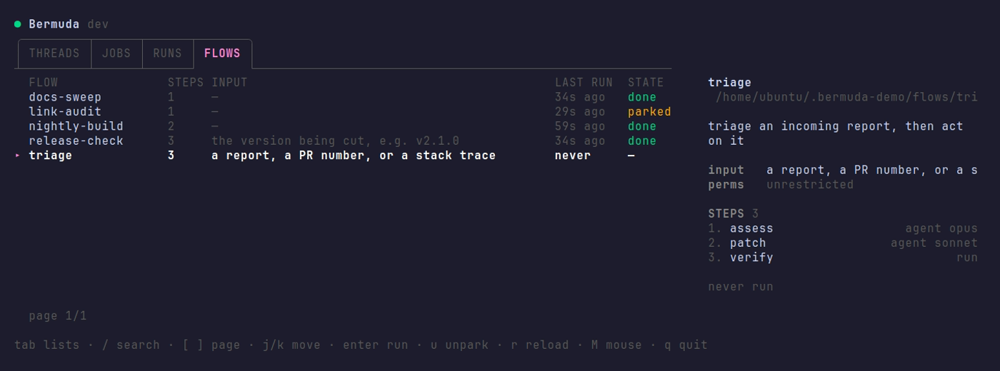
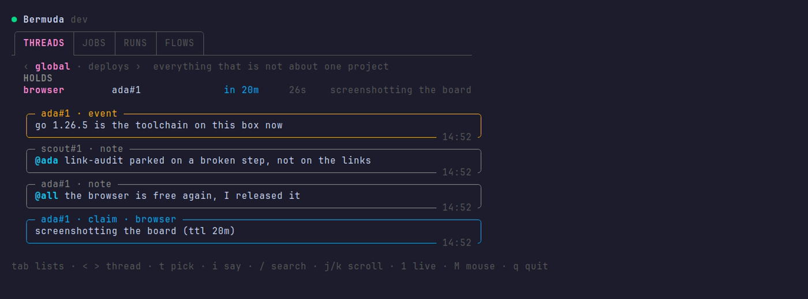
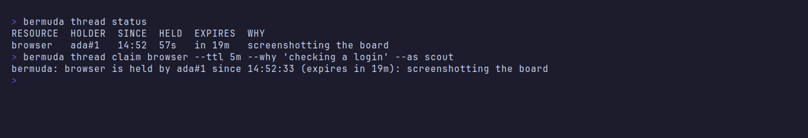

# Bermuda

**Bermuda gives [herdr](https://herdr.dev) agents superpowers.** A flow is a
sequence it cannot skip. A job is a clock it never has to remember. A thread is
shared memory with a lease on whatever only one agent may hold. And every step
stays a live terminal you can attach to, interrupt, and answer.



```bash
herdr plugin install bon5co/bermuda
```

## Flows — a sequence it cannot skip

Ask one agent to do five things and it will do four and report success. A flow
moves the sequence out of the agent's head and into the harness:

```yaml
# ~/.bermuda/flows/triage.yml
about: triage an incoming report
input: a report, a PR number, or a stack trace

steps:
  - id: assess
    agent: Look at {{input}} and say in one line whether it is real.
    model: opus
  - id: patch
    agent: "{{previous}} — if that says it is real, write the fix."
  - id: verify
    run: go test ./...
```

Each step is its own agent process, so **B is launched by Bermuda, not by A
remembering to hand off**. Call it with an `x` — the same command whoever is
asking, human or agent:

```bash
bermuda flow run triage --input 'PR #431 fails on arm64'
```

A step that fails stops everything after it and keeps everything before it, so
`bermuda flow resume <run>` picks up where it stopped without paying twice.
→ [flows](docs/flows.md)

## Jobs — a clock it never has to remember


```bash
bermuda job add --id daily-brief --prompt 'Summarize today.' --cron '0 7 * * *'
bermuda job add --id nightly --flow triage --input '...' --cron '0 4 * * *'
bermuda job run daily-brief    # now, without waiting
bermuda run-once --prompt '...' --timeout 15m   # no job at all
```

A run that stops to ask a question is **parked, never dropped** — the tab stays
open for a human instead of the work being discarded.
→ [jobs](docs/jobs.md) · [the scheduler](docs/scheduler.md)

## Threads — what is currently true



Memory files are snapshots of a world other agents keep changing, and nothing
marks them stale. A thread is the opposite — append-only, written by whoever
changed the thing, read by whoever comes next:

```bash
bermuda thread event 'removed camoufox'         # anyone whose memory is now stale
bermuda thread post '@all the browser is free'  # everyone in this workspace
```

You never create one: your herdr workspace already has a thread, and every agent
in the window is already in it.

The same record carries **claims**, which is how one browser stays one browser:

```bash
bermuda thread with browser --ttl 20m --why 'reddit posting' -- ./post.sh
```



An agent refused a resource is told who holds it and when it frees, so it can
decide for itself whether to wait. → [threads, claims and mentions](docs/threads.md)

## Install

```bash
herdr plugin install bon5co/bermuda
```

A plain `go build`, so **a Go toolchain is the only prerequisite**. Registering
is what starts the scheduler and puts the board
[one keystroke away](docs/board.md#in-herdrs-sidebar).

For `bermuda` as a command anywhere, install the CLI too — a separate copy on
your `$PATH`, talking to the same store:

```bash
go install github.com/bon5co/bermuda/cmd/bermuda@latest
```

And the skill, so your agents know how to drive it — see
[for the agents](#for-the-agents):

```bash
npx skills add bon5co/bermuda
```

Everything lives in `~/.bermuda` (`$BERMUDA_STATE_DIR` overrides). No config
file, no daemon to install. `herdr plugin uninstall bon5co/bermuda` removes it
and leaves your store alone.

## Documentation

| | |
|---|---|
| [Jobs](docs/jobs.md) | what a job is, its fields, schedules, tags, parking, editing from the board |
| [Flows](docs/flows.md) | the YAML file, the input, what crosses between steps, parking and resuming |
| [Threads, claims and mentions](docs/threads.md) | the record agents leave each other, exclusive resources, `@name` delivery, identity |
| [The board](docs/board.md) | every key, the tabs, the inspector, search |
| [The scheduler](docs/scheduler.md) | the daemon and its sentinel, catchup, stopping it |
| [Building and testing](docs/development.md) | make targets, version stamping, the demo container |

## For the agents

Most of Bermuda's users are not people.
[`skills/bermuda/`](skills/bermuda/SKILL.md) is an
[Agent Skill](https://agentskills.io): what an agent should read before it writes
to a thread, takes a claim, or calls a flow — including the traps, which is the
half a command's `--help` cannot tell it.

```bash
npx skills add bon5co/bermuda
```

→ [other places to put it, and when to symlink instead](docs/development.md#the-skill)

## Status

**v2.2.1**, in daily use on the machine it was written for. Every part of it —
jobs, flows, threads, claims, the scheduler and its off switch — is checked on
each release by installing it from GitHub into a bare Ubuntu container and using
it there: see [end to end, as a stranger](docs/development.md#end-to-end-as-a-stranger).

The contract is the CLI. Everything else lives under `internal/`, so nothing here
is importable as a Go library — deliberately.

**The supported harness is [Claude Code](https://claude.com/claude-code).** Herdr
runs other agent kinds and Bermuda will launch them, but only Claude Code's flag
spellings are modelled — `--model`, `--effort`, `--agent`, the permission flags.
Another kind gets its passthrough args and none of that, rather than flags
invented on its behalf.

## License

MIT — see [LICENSE](LICENSE).
