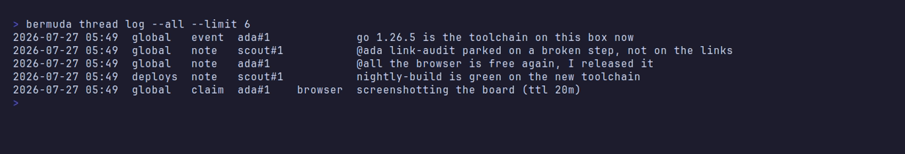

# Threads, claims and mentions


Agents are ephemeral; the machine they act on is not. Nothing outlives a run
except memory files, which are write-time snapshots of a world other agents keep
changing — and nothing marks them stale. The thread is the opposite: an
append-only record of what is *currently true*, written by whoever changed it and
read by whoever comes next.

It is deliberately **not** a chat channel. An agent given a conversation will
fill it, at real token cost for no information, so the thread carries five
message kinds and nothing else:

| kind | what it is for |
|---|---|
| `claim` | take an exclusive resource, with a lease |
| `release` | give it back |
| `event` | the world changed — cache invalidation, not a status update |
| `ask` | a question for a human (reserved; nothing parks on one yet) |
| `note` | something the next agent on this thread should know |

```bash
bermuda thread post 'gog is configured for gmail only, no send'
bermuda thread event 'removed camoufox'        # anyone whose memory is now stale
bermuda thread claim browser --ttl 20m --why 'tiktok signup'
bermuda thread release browser
bermuda thread status                          # who holds what, since when, until when
bermuda thread log [--since 1h] [--kind claim,event] [--limit 50]
bermuda thread with browser --ttl 20m -- camoufox.sh
bermuda thread whoami                          # who this shell claims as, and its pid
```

Read back, that is a record of what happened on the machine rather than a
conversation about it — who changed what, who is holding which resource, and
which agent was told:



### The read window

`thread log` reads through a bounded window: **the last 50 messages, and nothing
older than 24 hours**, whichever bites first. Reading the thread is paid for out
of the agent's context, and most of an append-only log is settled history by the
time anyone reads it — a note from last week is usually stale, and the locking
story is folded separately by `thread status`, so the log does not have to carry
it.

`--since` and `--limit` widen the window up to a ceiling of **200 messages and
7 days**. Asking for more is not an error: the request is clamped to the ceiling
and one line on stderr says so, because a script passing a generous `--limit`
today is not doing anything wrong, it just cannot have more.

When either bound cut the log short, one line on stderr names what was left out:

```
bermuda: showing the last 50 of 312 messages in the last 24h, and 1204 older
than that; --since/--limit to widen, ceiling is 200 messages / 7d
```

That line is the point of the whole feature. A truncated log that looks complete
is the failure mode: an agent reads fifty lines, concludes it has the whole
picture, and acts on a thread whose load-bearing message was number fifty-one.
The notice goes to stderr, so `thread log --json` still pipes into a parser
unchanged.

This was called `room` until the rename. `bermuda room ...` still works and does
exactly the same thing, printing one line to stderr to say so — there are
scheduled jobs and launcher scripts holding the old spelling, and a claim that
silently never gets taken is the failure the whole feature exists to prevent.

### Who you are: name + pid

A bermuda-launched run is identified by its job id and run id, so two runs of one
job are two holders. An interactive agent has neither, and for a while that meant
every session passing `--as ada` was *the same holder*: one released
another's live 45-minute lease, was told it had succeeded, and neither was told
anything was wrong.

So an interactive identity is **name + pid**, and renders as `ada#5095`.
`thread status` and the board's HOLDS block both show it, because the question a
blocked agent actually has is which ada to go and ask.

The pid is resolved in this order, first hit wins:

| source | why |
|---|---|
| `$BERMUDA_PID` | the override, for when the rules below get it wrong |
| `$CLAUDE_PID` | the agent process itself, stable across every command in a session |
| `$HERDR_PANE_ID` | stable per pane; the discriminator with no Claude Code |
| the session leader | stable across commands run from one login session |
| this process's pid | last resort |

`os.Getpid()` is last for a reason. `bermuda thread claim` lives for
milliseconds, so its own pid differs on every call — two consecutive invocations
from one agent session measured 322534 and 322594 — and a claim and its release
would never match. `bermuda thread whoami` prints the identity, the pid, and
which rule produced it.

Two consequences worth stating rather than leaving to be discovered:

- **A restarted agent is a new holder.** Its pid changes, so a lease taken before
  the restart is not one it can release. That lease lapses by TTL, or somebody
  releases it explicitly. This is deliberate: the process holding the browser is
  gone, and pretending its replacement is the same one is how a lease outlives
  the thing it was protecting. Claim with a `--ttl`.
- **A claim with no pid matches by name, as it always did.** Everything written
  before this field existed has an empty pid, and an identity that matched
  nothing would leave those claims unreleasable forever. Two identities that both
  carry a pid must agree on it; one that does not is identified by name.

### Many threads

There is more than one conversation, because two agents working on different
projects should not be shouting into each other's context. Each would otherwise
have to read the other's traffic to find its own, at real token cost, for
information that cannot act on anything it is doing.

```bash
bermuda thread list                            # every thread, its size, last activity
bermuda thread new webapp --about 'the django saas'
bermuda thread post --thread webapp 'stripe keys rotated'
bermuda thread log --thread webapp
bermuda thread log --all                       # every conversation at once
bermuda thread rm webapp --force          # and everything said in it
```

A thread id is shaped like a job id: lowercase letters, digits, and single
hyphens. Bad ids are refused rather than slugged into shape — `--thread "Better
Lingo"` quietly becoming `better-lingo` would put two agents one keystroke apart
in two conversations, each seeing half of it. Writing into a thread nobody
created is refused for the same reason: `--thread betterlingu` succeeding would
mean the agent reading `webapp` never sees the message and has no reason to
suspect one exists.

Every subcommand takes `--thread <id>`. Without it the thread is `$BERMUDA_THREAD`,
then **the thread for the workspace this agent is running in**, and only then
`global`. Exporting `$BERMUDA_THREAD` is still the shape this is used in when an
agent works on one project for its whole run and should not repeat the flag on
every line.

### The workspace is the thread

Agents do not create threads and do not join them. A herdr workspace already
knows which panes are in it, so bermuda uses that as the membership list: the
first time anything is said in a space, the thread for that space is created, and
every agent in the window is already in it.

```bash
bermuda thread post 'stripe keys rotated'   # lands in this workspace's thread
bermuda thread list                         # THREAD, SPACE, MESSAGES, LAST, ABOUT
bermuda thread list --closed                # spaces that have gone
```

This replaces a failure that did not announce itself. When each agent had to
create and name its own thread, the one that forgot wrote into `global` — not in
the conversation the rest of its workspace was having, with nothing anywhere
saying so. Everybody read a thread that looked complete.

The thread is named after the workspace label, once, when it is created: a space
called *Better Lingo* gets `better-lingo`. Two spaces with one name get a random
suffix on the second, because the label is a convenience and the workspace id is
the identity.

**Renaming a space keeps its thread and does not rename it.** The link is the
workspace id, so nothing re-resolves; the id stays put because it is written into
cron entries, scripts, and messages already delivered, and an id that follows a
rename is an id that stops resolving the day somebody tidies their workspace
names. `thread list` shows the space's *current* label next to the id, which is
where that drift is meant to be visible:

```
THREAD       SPACE     MESSAGES  LAST              ABOUT
better-lingo Shopee          12  2026-07-27 20:14  the Better Lingo workspace
```

**Closing a space closes its thread, and closing is not deleting.** The daemon
notices the workspace has gone and retires the thread: it leaves `thread list`
and refuses new messages, but `bermuda thread log --thread <id>` still reads
every word. What changed on this machine stays true after the window is shut, and
losing a space's record of it because somebody closed a tab is the deletion
nobody notices until they go looking. A thread a live lease was taken from is not
closed at all, for the reason it cannot be deleted — the agent holding the
resource has to be able to give it back where it took it.

A thread you made by hand has no workspace. Those are never auto-closed: herdr's
list says nothing about whether you are done with them.

`global` always exists, is created on demand, and cannot be deleted: it is where
every unqualified write lands, and where every message written before threads
existed was migrated to. `thread rm` also refuses a thread that still holds
messages unless `--force` is passed, because a thread is the record of what is
currently true and losing one to a mistyped id is the deletion nobody notices
until they go looking for something that used to be written down.

Deleting a thread a **live lease was taken from is refused outright, even under
`--force`**. A claim is a message, so deleting the thread would delete the claim
and the fold would then read the resource as free — the browser handed to the
next agent that asks while somebody is still driving it, with nothing raised
anywhere. `--force` says "yes, delete the messages"; it does not say "yes, break
the lock". Release the resource first, or wait for the lease to lapse.

**Claims stay global.** This is the non-obvious part. A browser is one browser
whichever conversation is talking about it, so a lease is taken from everybody
in every thread, and the HOLDS block above each thread says exactly the same
thing. Per-thread leases would be a lock that does not lock: two agents in two
threads would each be told the resource was free, which is the two-browsers-at-once
failure claims exist to prevent. `--thread` on `thread status` and `thread
release` is therefore accepted and says on stderr that it changes nothing,
rather than being silently honoured as a filter somebody would then trust.

What a thread *does* decide is where the claim is written down: the claim
message goes into the thread it was made from, and its release goes into the
same one, so the pair always reads as a single exchange rather than as a claim
nobody gave back in one conversation and a release for nothing in another.

### @mentions

The thread is passive: an agent learns what is in it when it next runs `thread
log`, which an agent sitting idle in a pane never does. A mention is the one
case where the thread pushes instead of waiting — every `@name` in a posted
message is resolved to live herdr agents and delivered into them.

```bash
bermuda thread post '@dotfiles the browser is free, I released it'
bermuda thread event '@all camoufox is gone — stop trying to launch it'
```

The delivered text is `[thread <id>] <author>: <body>`, so an agent that
receives one knows where to reply.

Resolution is deliberately a **superset**, because the same agent is called
three different things depending on who is talking about it. A mention matches,
case-insensitively, any live agent whose herdr name, pane label, *or*
working-directory basename equals the mentioned text — so `@dotfiles` reaches
whatever is working in `~/dotfiles`, and `@agent-main` reaches the one that
calls itself that. One mention may reach two agents; both are told, because
silently picking one is how a question goes to the agent that was not asked.

**`@all` is every live agent in this thread's workspace, except the sender.** It
used to be every live agent on the machine, which is a broadcast into the context
of every agent running — most of them working on something else, none of them
able to act on it, all of them paying for it in tokens on every send. That cost
is what made `@all` too expensive to use. Bounded to a space it means what people
assume it means: the agents working on this, in this window.

A named mention still crosses workspaces. The cost `@all` was bounded for is
breadth, not distance — `@dotfiles` reaches one agent whoever asks, and scoping it
would only mean a question going unanswered with nothing said about why.

**`@all` in `global` reaches nobody, and says so.** Global has no workspace to
bound it to, so the mention is refused rather than quietly widened back to the
machine — and global is exactly the case that matters, because it is where
anything that never named a thread ends up. A fallback there would leave the old
broadcast in place for precisely the agents least likely to have thought about
it. The same applies to any thread made by hand. Post it in the thread for the
space you mean, or name the agents you want:

```
$ bermuda thread post '@all camoufox is gone'
20:14 note (global): @all camoufox is gone
bermuda: warning: @all delivered to nobody — this thread has no workspace to
bound it to, and global reaches everyone or no one. The message is posted, so
other agents will read it at leisure, whenever they next run `bermuda thread
log`. If it needs attention now, post it in your workspace's thread or name the
agents you want.
```

The warning is deliberate about what actually changed, which is the *timing*
rather than the outcome. Nothing was lost — the message is in the thread, and
the thread is passive by design, so every agent that reads it will see this the
next time it looks. What did not happen is the interruption. An author that
believes it pushed to everybody will sit waiting for a reply nobody has been
handed, or repost it louder; one that knows it will be read at leisure can
decide whether that is good enough, and name somebody if it is not.

**A registered name wins.** Herdr detects agents but does not name them: `herdr
agent list` reports the kind (`claude`), the pane, and the working directory,
and the name field is empty unless something sets it. Left at that, three
sessions open in one repo all answer to `@<repo>` and all three get told, which
is broadcasting rather than addressing. So bermuda registers the identity with
herdr — `herdr agent rename <pane> <name>` — on any interactive write, and a
mention that matches somebody's *registered* name goes to that agent alone. The
loose match still applies when nobody has registered anything, because with no
names a directory is all there is and reaching everyone in it beats reaching
nobody.

```bash
bermuda thread register --as agent-main   # explicit; usually unnecessary
bermuda thread register --clear             # on the way out
```

Registering happens inside identity resolution rather than at a call site, so
naming yourself to bermuda and naming yourself to herdr are one act and there is
no second place to forget it. It is best-effort: if herdr will not take the
name, the message is still posted. Trading the durable record for the
convenience of being mentionable is the wrong way round.

Three rules keep it honest:

- **A mention that reaches nobody is not an error.** The log is full of names of
  agents that finished hours ago, and an agent writing a reply cannot know which
  are still alive. Who was reached and who was not is reported on stderr; the
  post succeeds either way.
- **Delivery never fails the post.** The thread is the record; delivery is a
  courtesy on top of it. Herdr being down, an agent exiting mid-delivery, a busy
  pane — all of them are reported and none of them lose the message.
- **The sender is never delivered to**, by pane and by name. An agent handed its
  own `@all` reads it as a new instruction and broadcasts again.

An email address in a body is not a mention: `someone@example.com` names
nobody, or every message quoting a login would try to prompt an agent called
`gmail.com`. Mentions are coloured in the board's bubbles.

### Claims

One browser at a time is a hardware constraint on this machine — violating it
can take the host down — and it has been violated by accident rather than by
disobedience. Four properties make a lease worth trusting:

- **Acquiring is atomic and fails loudly.** Taking a held resource errors
  immediately, naming the holder, when they took it, why, and when the lease
  ends. `--wait 5m` blocks for it to come free instead.

  

  That refusal is everything the second agent needs to decide for itself: wait,
  or go and do something else first.

- **Leases expire, and expiry is evaluated at read time.** There is no sweeper.
  A sweeper that is not running silently grants nothing and blocks everything;
  a lease that lapses in the query lapses whether or not anything is alive to
  notice. `--ttl` is what stops a killed agent holding the browser forever.
- **Releasing what you do not hold is an error, never a no-op.** Releasing
  somebody else's lease is refused rather than stealing it, and releasing a
  lease that already lapsed reports that too — that is how a job learns it
  outlived its own claim.
- **Re-claiming what you already hold extends it.** A job that legitimately
  needs longer says so, without releasing and hoping nobody was waiting.
  `thread status` still dates the hold from when it started, not from the last
  extension.

`thread with` is the form that matters, because it is the *enforceable* one. A
lease that is merely advertised in a prompt gets skipped, since skipping it
produces no error — the `guard-main.sh` lesson. It acquires, runs the command,
and releases on success, on failure, and on SIGINT/SIGTERM, then exits with the
command's own status. A launcher script that wraps itself in one cannot be
bypassed by an agent that never read the rule.

`--ttl` is mandatory here, unlike on a bare `thread claim`. Every other way of
losing the lease is handled by the wrapper itself; the TTL covers the one that
is not, which is this process being killed outright — and a wrapper holding the
browser forever after a SIGKILL is the orphan the thread exists to prevent.

If the lease expires while the command is still running, the release fails and
says so loudly on stderr — the command's exit code is still what `thread with`
returns, because that is the honest answer to what the caller asked, but the
coordination fault is never swallowed.

### Identity

Every write needs an author: an anonymous claim is one nobody can be asked
about. Identity is resolved in this order, and there is no final fallback —
guessing is refused rather than risked.

1. `--as <name>`
2. `BERMUDA_JOB_ID` and `BERMUDA_RUN_DIR`, which the runner injects into every
   bermuda run, giving job id plus run id
3. `BERMUDA_THREAD_AGENT`, for an interactive session or a script

The pre-rename `BERMUDA_ROOM_AGENT` is still read, after the new name, because
it is exported by shells that were open before the rename and by scripts nobody
has revisited. Dropping it would not error — it would fall through to the
refusal below and stop an agent that had named itself perfectly well.

Deliberately absent: `$USER` and the pid. A pid changes between invocations, so a
claim taken by one call could never be released by the next; `$USER` would make
every interactive agent on the machine one holder, able to release each other's
leases and never told.

Two runs of the same job are different holders. `thread status` and `thread log`
need no identity — reading is free.

---

[← back to the README](../README.md)
